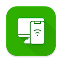
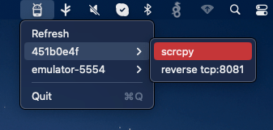

   
	<h1 align="center"><b>nanoAdb</b></h1>
	

		A lightweight macOS status bar app for managing Android devices via ADB commands.
     
     
    <b>Download for macOS from</b>
    macOS <a href="https://app.gitbutler.com/downloads/release/darwin/aarch64/dmg">release</a>·
     
  

# nanoAdb

	

"A macOS status bar app for React Native developers, making ADB device management easy. Includes support for port reverse and one-click screen mirroring with `scrcpy`."

# Features

- List devices and reverse port.
- [scrcpy](https://github.com/Genymobile/scrcpy) screen mirroring.

# Todo

- Add option auto reverse port on connect.
- Auto update device on every second.
- There is command to turn off phone screen add that.
- Also add --stay-awake options.
- Adb/scrcpy location detect.
